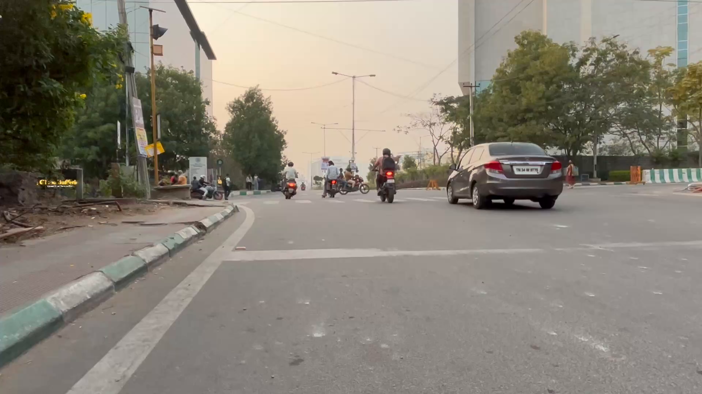
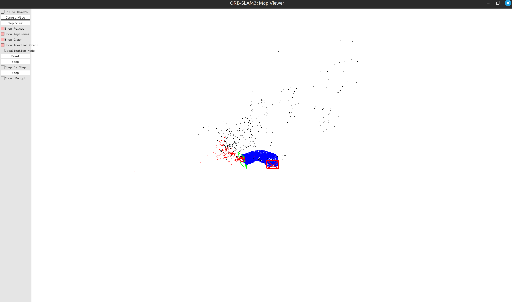
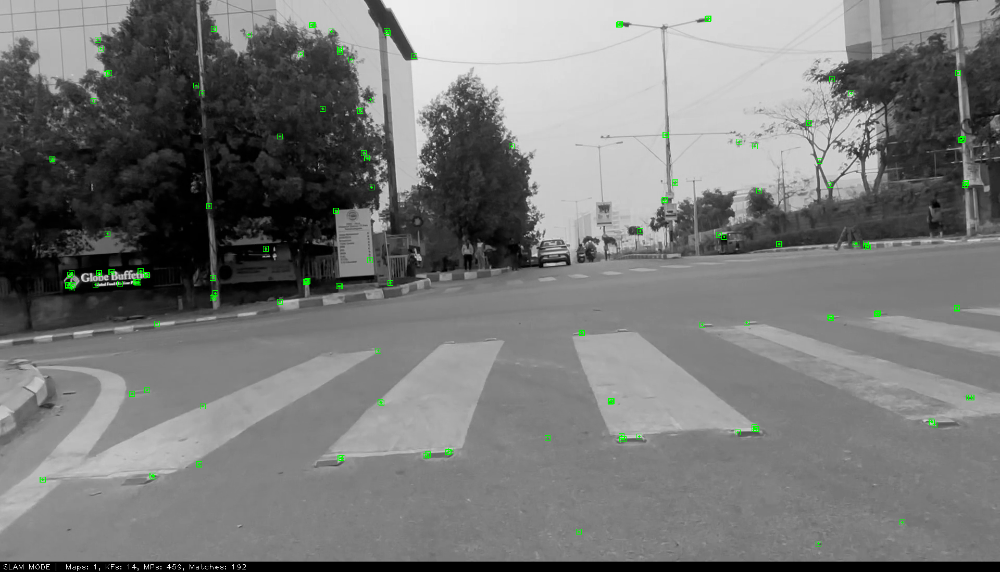
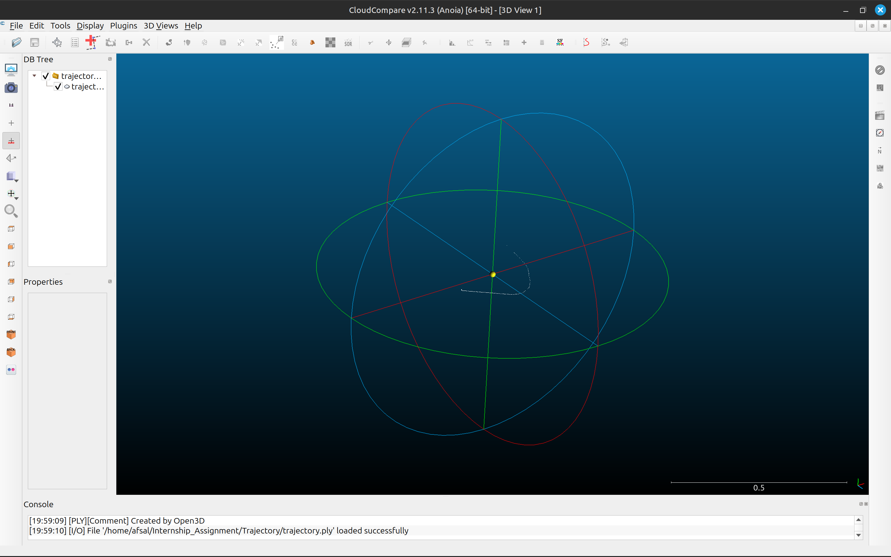

# Monocular Visual SLAM for Robot Localization and 3D Mapping

This project implements a Monocular Visual SLAM pipeline to localize a robot's position, generate a 3D point cloud of the environment, and visualize the robot's pose within the generated map. It uses **ORB-SLAM3** for feature-based localization, with **Open3D** and **CloudCompare** for visualization.

## Table of Contents

- [Project Overview](#project-overview)
- [Dependencies](#dependencies)
- [Setup Instructions](#setup-instructions)
- [File Structure](#file-structure)
- [Execution](#execution)
  - [Extract Frames from Video](#extract-frames-from-video)
  - [Run SLAM](#run-slam)
  - [Generate and Visualize Point Cloud](#generate-and-visualize-point-cloud)
- [Pose Localization in Point Cloud](#pose-localization-in-point-cloud)
- [Assumptions](#assumptions)
- [License](#license)

## Project Overview

Visual SLAM (Simultaneous Localization and Mapping) enables robots to build a map of an unknown environment while simultaneously tracking their own position using visual data from cameras. Monocular visual SLAM processes images from a single camera to estimate motion and reconstruct the surroundings in 3D. The core steps include feature extraction, pose estimation, and map building.

This project uses **ORB-SLAM3**, a state-of-the-art open-source SLAM system capable of real-time operation with monocular, stereo, and RGB-D cameras. ORB-SLAM3 extracts ORB features from video frames, tracks these features across frames to estimate the camera's trajectory, and triangulates 3D positions to build a sparse point cloud map of the environment. The system also supports loop closure to correct drift and optimize the map for accuracy.

The pipeline outputs:
- A 3D point cloud representing the environment
- The robot/camera's estimated trajectory
- Visualization tools for analysis

## Dependencies

- **Python 3.x**
- **OpenCV** (for image processing)
- **ORB-SLAM3** (for visual SLAM)
- **CloudCompare** (optional, for point cloud visualization)

### Install Required Python Libraries


### ORB-SLAM3 Setup

Clone the official ORB-SLAM3 repository and follow its documentation for building and configuration.


Build ORB-SLAM3 with the appropriate dependencies for monocular vision as per the [official instructions](https://github.com/UZ-SLAMLab/ORB_SLAM3).

## Setup Instructions

1. **Clone this repository:**

    ```
    git clone https://github.com/yourusername/Internship_Assignment.git
    cd Internship_Assignment
    ```

2. **Install dependencies:**

    ```
    pip install -r requirements.txt
    ```

3. **Set up ORB-SLAM3:**  
   Follow the official instructions to build and configure ORB-SLAM3 for monocular vision.

4. **Prepare input video:**  
   Place your monocular video file (e.g., `video_input.mp4`) in the project directory.

## File Structure

```
INTERNSHIP_ASSIGNMENT/
│
├── Algorithm/
│   ├── KeyFrameTrajectory.txt
│   └── run_slam.py
│
├── Extract_Frames/
│   └── extract_frames.py
│
├── resources/
│   ├── a.png
│   ├── b.png
│   ├── camera.yaml
│   └── map_viewer.png
│
├── Trajectory/
│   ├── convert.py
│   └── trajectory.ply
│
├── KeyFrameTrajectory.txt
└── README.md
```

## Execution

### Extract Frames from Video

Extract frames from the input video:



### Run SLAM

Process the frames and run the ORB-SLAM3 pipeline:



### Generate and Visualize Point Cloud

Save the generated point cloud for visualization:


You can visualize the point cloud using CloudCompare.


## Pose Localization in Point Cloud

To visualize the robot's pose within the 3D map:


This will display the robot's estimated position in the point cloud for each frame.


## Assumptions

- The input is from a single monocular camera with known calibration.
- ORB-SLAM3 is used for feature extraction, matching, and localization.
- Pose data format: `[time, x, y, z, qx, qy, qz, qw]` (position and orientation as quaternion).
- Point cloud and pose localization use nearest-neighbor matching.
- Input video and frames are pre-processed and synchronized with the SLAM pipeline.

## License

This project is licensed under the MIT License. See the [LICENSE](LICENSE) file for details.

---

**References:**  
- ORB-SLAM3: An Accurate Open-Source Library for Visual, Visual-Inertial and Multi-Map SLAM  
- Visual SLAM overview and applications in robotics
